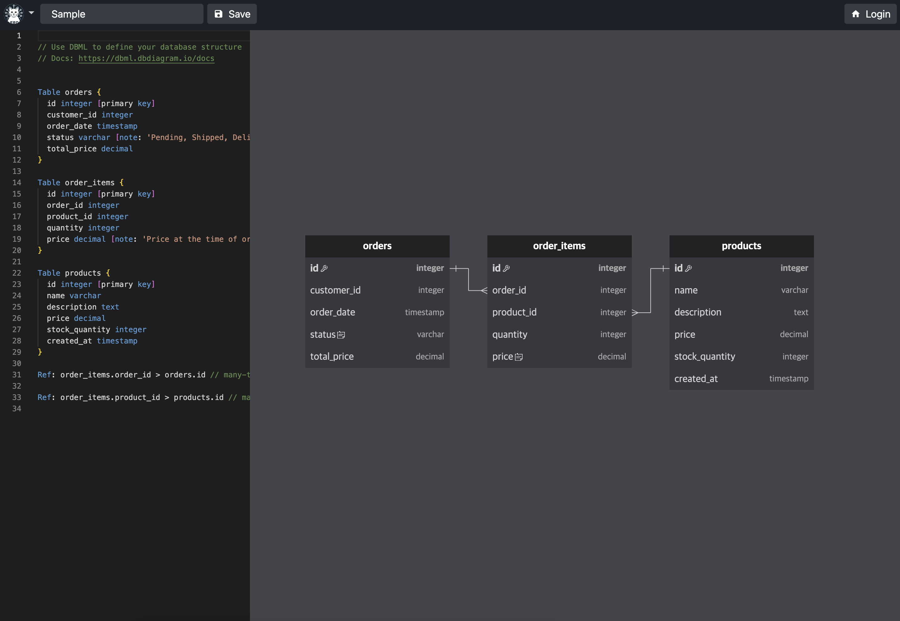

# Easy RD - Database Relationship Diagram Tool

Easy RD is a web-based tool for creating and sharing database relationship diagrams using DBML (Database Markup Language). It provides an intuitive interface for designing database schemas with real-time visualization.



## Features

- 📝 **DBML Editor**: Write database schemas using DBML syntax with syntax highlighting
- 🎨 **Real-time Visualization**: See your database diagram update as you type
- 🔗 **Shareable Projects**: Share your diagrams with others via unique URLs
- 👥 **Collaboration**: Invite team members to view or edit your diagrams
- 🔒 **Permission Management**: Control who can view, edit, or manage your projects
- 📱 **Responsive Design**: Works seamlessly on desktop and mobile devices

## Tech Stack

- **Frontend**: SvelteKit, TypeScript, Tailwind CSS
- **Backend**: SvelteKit API routes
- **Database**: Drizzle ORM (supports multiple databases)
- **Authentication**: Auth.js (OAuth providers)
- **Visualization**: Custom diagram renderer using @meursyphus/flitter

## Getting Started

### Prerequisites

- Node.js 18+ and npm
- A database (Cloudflare D1, PostgreSQL, MySQL, or SQLite)
- OAuth credentials (GitHub, Google, etc.)

### Installation

1. Clone the repository:
   ```bash
   git clone https://github.com/yourusername/easy-rd.git
   cd easy-rd
   ```

2. Install dependencies:
   ```bash
   npm install
   ```

3. Set up environment variables:
   ```bash
   cp .env.example .env
   ```
   
   Edit `.env` and configure:
   - `AUTH_SECRET`: Generate with `openssl rand -base64 32`
   - `OAUTH_CREDENTIALS`: Your OAuth provider credentials
   - Database connection (see database setup below)

4. Set up the database:
   ```bash
   # Generate migrations
   npm run migration:generate
   
   # Apply migrations
   npm run migration:apply
   ```

5. Run the development server:
   ```bash
   npm run dev
   ```

Visit `http://localhost:5173` to see the application.

## Configuration

### Authentication

Easy RD uses Auth.js for authentication. See [src/lib/auth/README.md](src/lib/auth/README.md) for detailed setup instructions.

### Database

The project uses Drizzle ORM and can work with multiple databases. See [src/lib/server/drizzle/README.md](src/lib/server/drizzle/README.md) for database configuration options.

### Notifications

The notification system is abstracted to support multiple providers (Discord, Slack, Email, etc.). See [src/lib/server/service/notification-service.ts](src/lib/server/service/notification-service.ts) for implementation examples.

## Development

### Project Structure

```
src/
├── lib/
│   ├── api/          # API client
│   ├── auth/         # Authentication setup
│   ├── components/   # Reusable components
│   ├── dbml/         # DBML parser and types
│   ├── server/       # Server-side code
│   └── ui/           # UI components
├── routes/           # SvelteKit routes
└── stories/          # Storybook stories
```

### Available Scripts

- `npm run dev` - Start development server
- `npm run build` - Build for production
- `npm run preview` - Preview production build
- `npm run lint` - Run linter
- `npm run format` - Format code
- `npm run storybook` - Start Storybook
- `npm run migration:generate` - Generate database migrations
- `npm run migration:apply` - Apply migrations locally

## Deployment

### Cloudflare Pages

1. Build the project:
   ```bash
   npm run build
   ```

2. Deploy to Cloudflare Pages:
   ```bash
   wrangler pages deploy .svelte-kit/cloudflare
   ```

### Other Platforms

The project can be deployed to any platform that supports SvelteKit. You may need to:
1. Configure the appropriate adapter
2. Set up environment variables
3. Configure your database connection

## Contributing

Contributions are welcome! Please feel free to submit a Pull Request.

1. Fork the repository
2. Create your feature branch (`git checkout -b feature/amazing-feature`)
3. Commit your changes (`git commit -m 'Add some amazing feature'`)
4. Push to the branch (`git push origin feature/amazing-feature`)
5. Open a Pull Request

## License

This project is licensed under the MIT License - see the LICENSE file for details.

## Acknowledgments

- [DBML](https://www.dbml.org/) for the database markup language
- [SvelteKit](https://kit.svelte.dev/) for the amazing framework
- [Drizzle ORM](https://orm.drizzle.team/) for the type-safe database toolkit
